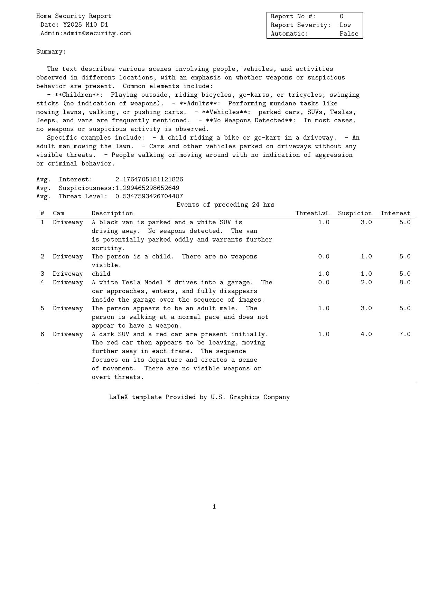

# Security Camera Report Generator  

A tool that generates PDF reports based on AI detections from your security cameras, integrated with the Frigate NVR system.  

## Features  
- **Integration with Frigate NVR**: Leverages local AI object detection capabilities to analyze footage and generate detailed reports [1].  
- **PDF Reports**: Creates comprehensive PDF documents summarizing detected objects and actions.  

### Planned Features
- [ ] Automatic Timed and requested report generation.
- [x] Built in pdf rendering (currently requires manual running.)
- [ ] Web page with report history and manual generation controls.

## Installation
1. Clone the project.
2. Edit Settings.toml and insert the url for your frigate instance
3. In your frigate config make sure to enable genai and put this in your prompt ``` Respond only in this json schema, do not include newlines and do not escape quotes. ( "type": "object", "properties": ( "threat_level": ( "type": "integer", "description": "user name" ), "suspiciousness": ( "type": "integer" ), "interest": ( "type": "integer" ), "description": ( "type": "string") ), "required": [ "threat_level", "suspiciousness", "interest", "description" ] )' ```
4. Make sure that Ollama is running and available on your local machine with the deepseek:32b model pulled (this can be changed in the source code but should be moved to the config).

## Requirements  
- An active Frigate NVR setup with supported AI accelerators for object detection [1].  
- Cameras configured with IP addresses or RTSP streams (as supported by Frigate)
- Compatible hardware to handle local processing of AI models.  
- Local Ollama instance with deepseek:32b pulled.


